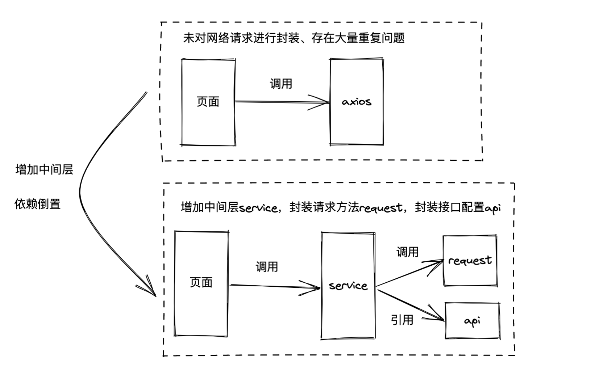
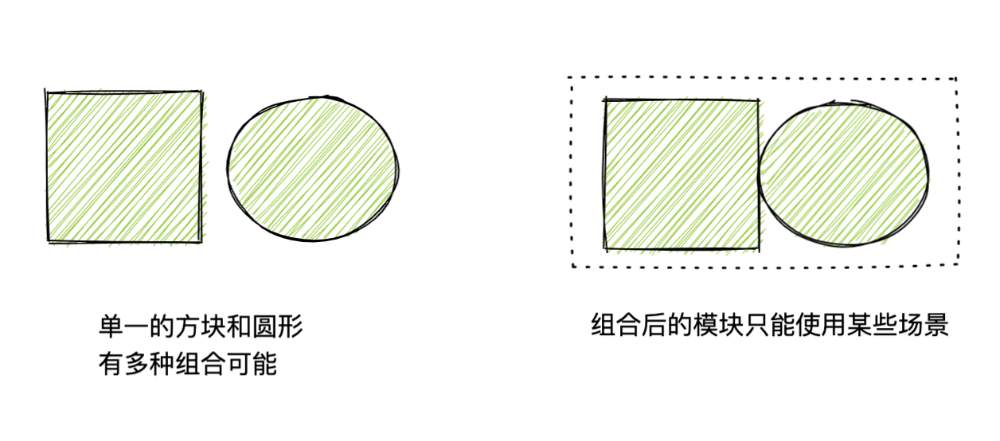
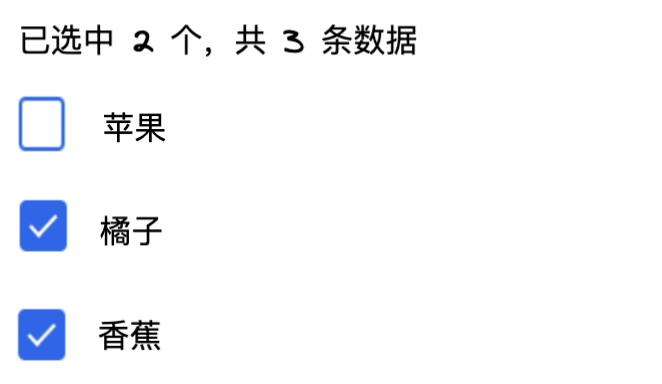

软件开发中，有个很重要的DRY原则，即Dont Repeat Yourself，也就是不要重复自己。

重复的代码会带来以下问题：

- 开发效率低，重复造轮子
- 不同人开发的同一类功能，质量层次不齐
- 可维护性差，修改问题时可能会遗漏，修了这个地方，忘了那个地方，导致一个bug反复修改多次。

重复产生的原因是多方面，有的是工作模式导致的，有的是编码导致的，弄清楚重复的原因，也就很容易找出消除重复的方法。

# 一、工作模式导致的重复

## 1.1 团队缺少沟通

同一个团队可能会针对相同或相似的功能进行编码，有时你封装了一个功能，却没有在团队内部大量使用， 究其原因可能是大家根本不知道有这么个功能，或者不知道怎么使用，干脆自己写，也或者虽然有点相似，但是并不完全适用自己。

这类问题核心还是沟通问题，所以要根本解决这类重复，我们必须在工作流程上做一些改进。

1. 基础功能开发评审

当你要开发一个基础功能时，需要发起设计评审，这样首先起到了周知的作用，让大家知道有这么个东西， 其次大家会针对功能提出自己的建议，以方便他人后续使用。

2. 基础功能宣贯

在开发完某个功能之后，需要及时的进行宣贯，让其他同事知道可以使用了，可以在每周的团队周会上安排一个环节， 进行公共功能的变更宣贯。

3. CodeReview

CodeReview中发现存在重复问题，及时提出修正。

## 1.2 缺少基础设施-公共库

在一个项目中，我们可能建一个公共的文件夹，比如common，用来存放我们的基础组件和库，但是一旦跨项目，这种方式就无效了， 如果没有公共库，就需要进行复制粘贴了，把一段代码从一个项目复制到另一个项目，这样就造成一个问题的修改需要同时修改多个项目， 如果赶上项目时间紧张，再加上可能有懒惰思想，慢慢的多个项目之间的基础功能就不再一致了，后续的维护更加复杂。

解决这类问题可以参考两个方法：

1.使用monorepo

monorepo也就是单一仓库管理多个项目，有些公司将所有代码存储在一个代码库中，由所有人共享， 因此monorepo可以非常大。例如，理论上谷歌拥有有史以来最大的代码库，每天有成百上千次提交，整个代码库超过 80 TB。 其他已知运营大型单一代码库的公司还有微软、Facebook 和 Twitter。

我们可以在monorepo中添加一个公共项目，用来存放我们的基础组件和utils工具库。

2.通过发布公共包

可以建设一个基础组件库，发包到npm或者公司内部的包管理系统。

monorepo和npm发包各有优缺点，根据自身情况进行选择。

## 1.3 知识的重复

在团队中不只是代码存在重复，在知识层面也会存在重复，比如大家重复的进行某个知识的学习，包括技术上的和业务上的， 整体上增加了团队工作的重复，降低了效率。

针对知识的重复我们可以定期举办内部分享。

1. 新功能上线演示

针对一些大的功能上线，可以组织内部的上线演示，一方面增加大家对业务的了解，另一方面，减少大家后续重复学习的问题。

2.定期分享

团队内部定期举办业务、技术、工作方法/效率等方面的分享，减少对知识学习的重复工作。

# 二、编码层面的重复

## 2.1 没有意识到重复

有时候重复的代码并不是那么明显，可能只是几行代码，由于重复的行数较少，所以就很自然的采用复制粘贴， 没有意识到重复的发生。

比如针对一个应用的状态判断，应用存在多种状态，比如未安装(Uninstalled)、运行中（Running）、已销毁（Destroyed）等，
只有当应用处于未安装或者已销毁状态才允许安装，而这个条件可能在多处都使用。

```javascript
// 应用列表页在进行安装操作时进行状态的判断
function install(app) {
    if (['Uninstalled', 'Destroyed'].includes(app.status)) {
        
    }
}
```

```vue
<!--应用详情页在进行安装时进行状态的判断-->
<template>
  <button v-if="['Uninstalled', 'Destroyed'].includes(app.status)">安装</button>
</template>
```

每当安装条件发生变更时，都要四处寻找然后一个一个地方修改，针对这种也应该进行封装，虽然他很小。
我们可以封装一个判断是否能安装的方法，其他地方进行引用。

```javascript
//抽象一个方法，判断是否能按照
function canInstall(app) {
    return ['Uninstalled', 'Destroyed'].includes(app.status)
}


//在需要进行状态判断的地方引用封装的函数
function install(app) {
    if (canInstall(app)) {

    }
}
```

后续安装条件发生变更，只需要修改canInstall方法即可

```javascript
//需求发生变化，InstallError状态也支持安装
function canInstall(app) {
    return ['Uninstalled', 'Destroyed', 'InstallError'].includes(app.status);
}
```

我们一般对大块的重复代码比较敏感，而对于小块的代码重复，则一般会忽略，但是重复是不分大小的，小段代码有时重复次数可能更多，而且修改起来更容易遗漏。

## 2.2 缺少抽象和封装

举个夸张的例子，如果要让你炸毁地球，不应该直接写一个炸毁地球的方法，而是写一个炸毁星球的方法，将地球作为参数传进去，这样一旦后续需求扩展，比如让你炸毁火星，只需要调用之前的炸毁星球方法即可，只是参数变化了。

抽象的东西要比具体的东西复用性更强，因此要想提高复用性，就要对所做的功能进行抽象，而不是面向具体单一的业务需求开发。

**示例1：组件的重复**

比如在删除产品时需要用户输入产品的名称进行二次确认，输入正确后才能进行删除，于是针对这个业务场景封装了一个弹窗确认组件， 在调用显示弹窗方法showDialog时，传入一个名为产品名称(productName)的参数。

```vue
<!--删除确认弹窗 DeleteProduct.vue 的实现-->
<template>
    <el-dialog
        title="删除产品确认"
        :visible.sync="dialogVisible"
        @confirm="confirmHandler"
    >
        <div>请输入<span>{{ productName }}</span>确定删除</div>
        <el-input v-model.trim="inputName"/>
    </el-dialog>
</template>

<script>
export default {
    data() {
        return {
            dialogVisible: false,
            productName: '',
            inputName: ''
        };
    },
    methods: {
        showDialog(params) {
            this.productName = params.productName;
            this.dialogVisible = true;
            this.inputName = '';
        },
        confirmHandler() {
            if (this.inputName === this.productName) {
                this.dialogVisible = false;
                this.$emit('delete');
            }
        }
    }
};
</script>
```

这个删除确认弹窗只能在删除产品时可以使用，假如现在删除用户也需要输入用户名称进行二次确认，这个组件就无法使用了，首先弹窗的title不合适，这里固定是"删除产品确认"，其次在调用showDialog方法时传递的参数key为productName，如果在删除用户时传递一个productName参数，就会显得非常怪异。

显然，这个组件没有进行抽象，只是针对当前具体业务场景进行了封装，我相信这位同事并不是没有能力封装一个通用的组件，而是缺少抽象的思维，导致写出了面向具体单一业务的组件，我们只需要做两点改动，就能让它变成一个非常通用的二次删除确认组件，把title变成可变的，将productName改为value。

```vue
<!--删除确认弹窗 DeleteConfirm.vue 的实现-->
<template>
    <el-dialog
        :title="title"
        :visible.sync="dialogVisible"
        @confirm="confirmHandler"
    >
        <div>请输入<span>{{ value }}</span>确定删除</div>
        <el-input v-model.trim="inputName"/>
    </el-dialog>
</template>

<script>
export default {
    data() {
        return {
            dialogVisible: false,
            title: '',
            value: '',
            inputName: ''
        };
    },
    methods: {
        showDialog(params) {
            this.value = params.value; //将productName改为更加通用的value
            this.title = params.title; //传递确认弹窗的title
            this.dialogVisible = true;
            this.inputName = '';
        },
        confirmHandler() {
            if (this.inputName === this.value) {
                this.dialogVisible = false;
                this.$emit('delete');
            }
        }
    }
};
</script>
```

这样，无论是删除产品、用户、订单等等，只要需要弹窗进行二次输入确认，都可以复用这个组件了。

试着利用抽象思维，写出更具复用性的代码。

**示例2：样式的重复**

比如在CSS中，经常会针对某段文字设置字体大小、颜色等，一般情况下，同一个网站的字体大小、颜色是存在共性的， 比如标题的颜色每个页面都是一样的，提示类型的文字颜色也是一样的，如果没有进行抽象，那么我们代码可能是这样的。

```css
.news-title {
    color: #409EFF;
    font-size: 16px;
}

.app-title {
    color: #409EFF;
    font-size: 16px;
}
```

这样的设置会在样式中存在大量的重复，大致有两个解决方法。

第一种就是对整个网站的css进行分层，比如样式分为全局样式、页面样式和组件样式。我们可以在全局样式中抽取共性的css样式。

比如抽取common.css，定义网站通用标题的样式。

```css
.common-title {
    color: #409EFF;
    font-size: 16px;
}
```

另外一种就是通过抽取一些变量，在页面样式和组件样式中引用这些变量。

比如element中的var.scss

```scss
/* Color
-------------------------- */
/// color|1|Brand Color|0
$--color-primary: #409EFF !default;
/// color|1|Background Color|4
$--color-white: #FFFFFF !default;
/// color|1|Background Color|4
$--color-black: #000000 !default;

/* Size
-------------------------- */
$--size-base: 14px !default;

/* z-index
-------------------------- */
$--index-normal: 1 !default;
$--index-top: 1000 !default;
$--index-popper: 2000 !default;
```

后续如果想修改网站的配色，只需要修改模板文件即可。

**示例3：网络请求的重复**

网络请求也是重复容易滋生的地方，比如在一个组件内部请求文章的详情方法getNewsDetail，看看有那几处重复呢？

```vue

<script>
import axios from 'axios'

export default {
  methods: {
    getNewsDetail(id) {
      axios.get('/api/v1/news/detail/' + id).then(res => {
        this.detail = res
      }).catch(e => {
        if (e.code === '401') {
          showToast('未登录，请先登录')
        } else {
          showToast('接口请求失败')
        }
      })
    }
  }
}
</script>
```

上述代码可能存在如下重复问题：

- 接口地址可能存在重复，别的页面也能会使用文章详情接口，如果接口地址发生变更需要修改多处
- 请求方法可能存在重复，别的页面如果也要请求文章详情，也需要写一个getNewsDetail方法
- 错误处理存在重复，多个网络请求可能都要进行相同的错误处理
- 请求依赖具体的第三方库axios，如果有一天要更换网络请求库，则需要进行大量的修改

接下来我们来逐一解决这些重复。

首先是依赖axios的问题，我们尽量不要直接依赖某个第三方插件，解决办法也很简单，就是增加一层封装， 这样把依赖局限在具体某个方法内部，后续要替换只需要更改一处即可，也就是上层业务不依赖底层实现。

我们要明白一点，不是axios有什么功能，我的网络请求怎么调用，而是我想怎么调用网络请求，需要如何利用axios去实现， 也就是要遵循"依赖倒置原则"。

我们可以实现一个request方法，来完成网络请求，内部调用axios，同时进行通用的错误处理。

```javascript
// request.js
import axios from 'axios'

export default function request(config) {
    return new Promise((function (resolve, reject) {
        axios(config).then(res => {
            if (res.code && res.code === 200) {
                resolve(res)
            } else if (res.code === 401) {
                //其他各种错误处理类似
                showToast("网络请求失败")
                window.location.href = '/#/login'
            } else {
                reject(res)
            }
        }).catch(e => {
            reject(e)
        })
    }))
}

['get', 'post', 'put', 'delete'].forEach(method => {
    return function (url, params, body, options) {
        return request({
            method,
            url,
            params,
            body,
            ...options
        })
    }
})

```

针对接口重复问题，我们可以创建一个 api.js文件，来配置各个接口地址。

```javascript
export default {
    newDetail: '/api/v1/news/detail/:id'
    // 其他接口地址
}
```

针对接口调用重复问题，我们可以封装一个service层，所有页面调用均通过调用service层方法来实现。 

service/news.js：
```javascript
import request from './utils/request'
import api from './api'

export default {
    getNewsDetail(id) {
        return request.get(api.newDetail, {id}).then(res => {
            return res.data
        })
    }
}
```

修改之前和修改之后对比如下，通过增加中间层service.js、封装网络请求方法request以及封装接口地址配置常量api.js， 大大降低网络请求中的各种重复问题，同时也不再依赖第三方axios，实现了解耦。



## 2.3 职责不单一

单一职责是一个很重要的编程原则，这是提高复用性的一个重要方法，单一职责的函数或者组件，就像是一个小积木块，而不满足单一职责特性的函数或组件就像是一个功能模块，功能模块只能应用在特定的业务场景中，而积木块可以通过各种排列组合满足不同业务需求，绽放出强大的生命力。



比如之前同事实现了一个下载一段文字的功能，这个功能分为两步，第一步将文字内容转为url，第二步通过创建a标签实现下载。 downloadText方法实现如下：

```javascript
function downloadText(text, filename) {
    //根据text内容，创建url
    let blob = new Blob([content]);
    let url = URL.createObjectURL(blob);

    //创建a标签，通过模拟a标签的点击实现下载
    let eleLink = document.createElement('a');
    eleLink.download = filename;
    eleLink.style.display = 'none';
    eleLink.href = url
    document.body.appendChild(eleLink);
    eleLink.click();
    document.body.removeChild(eleLink);
}
```

很明显这里不符合单一职责，一共做了两件事：根据文本创建url、根据url进行下载。假如我现在不是根据text文本进行下载，而是给定一个具体src下载，则不能使用这个方法，可能还要再写个downloadUrl方法，很明显，二者之间会有很多重复。

```javascript
function downloadUrl(url, filename) {
    //这部分代码和downloadText中完全一致
    let eleLink = document.createElement('a');
    eleLink.download = filename;
    eleLink.style.display = 'none';
    eleLink.href = url
    document.body.appendChild(eleLink);
    eleLink.click();
    document.body.removeChild(eleLink);
}
```

根据单一职责原则对downloadText方法进行拆分，可以拆成两个，一个根据文本生成url，一个根据url进行下载，如果还想保留downloadText， 只需要组合这两个小方法即可，这样我们一下就产出了3个通用方法。

```javascript

function createUrlByText(text) {
    let blob = new Blob([text]);
    return URL.createObjectURL(blob);
}

function downloadUrl(url, filename) {
    let eleLink = document.createElement('a');
    eleLink.download = filename;
    eleLink.style.display = 'none';
    eleLink.href = url
    document.body.appendChild(eleLink);
    eleLink.click();
    document.body.removeChild(eleLink);
}

//对上面的单一职责功能进行组合
function downloadText(text, filename) {
    let url = createUrlByText(text)
    downloadUrl(url, filename)
}
```

其实功能实现并没有本质的区别，只是简单的进行拆分，使其满足单一职责原则，即大大提高了复用性。

## 2.4 数据之间的重复

数据之间的重复，也是经常出现的一种重复问题，也就是能用1个字段表示的数据，不要用2个或多个字段表示。 通常可以有1个基础的数据字段，其他字段可以通过这个基础字段来计算，而不是维护其他几个额外字段。

比如要实现如下的一个列表，一共有3个字段：列表数据list、已选中数量selectedCount、总数量totalCount。



假如维护这三个字段，每次当列表数据发生变化时（可能是选择状态变化，也可能是增删数据）， 都要小心设置selectedCount、totalCount，否则就会出现数据不一致的bug，这其实是一种逻辑上的重复。

我们可以只维护一个基础数据list，selectedCount和totalCount都可以通过对list进行计算而得到， 可能是写一个方法每次刷新组件时重新计算，也可以利用vue中的计算属性。

```vue

<script>
export default {
  data() {
    return {
      list: [
        {
          name: '苹果',
          selected: false
        },
        {
          name: '橘子',
          selected: true
        },
        {
          name: '香蕉',
          selected: true
        }
      ]
    }
  },
  computed: {
    selectedCount() {
      return this.list.filter(item => item.selected).length
    },
    totalCount() {
      return this.list.length
    }
  }
}
</script>
```

这样我们只需要对list进行处理即可，其他两个字段自动计算出来，避免数据不一致问题。

# 三、复用和耦合

复用虽好，但是也不能贪杯，因为复用就意味着耦合，不合理的复用会导致严重的耦合，代码可读性及可维护性变差。

不合理的复用，甚至不如不进行复用，所以在进行复用抽象时，应该慎重。

## 3.1 充斥着各种if-else的复用

有的复用并不是真正的复用，而是将一些功能集中到了一个函数内部，然后再内部进行大量的if-else判断，实际是把逻辑复杂性转移到了函数内部， 由于存在大量的分支判断，复杂度呈现指数式增长。

比如应用的安装、重启、销毁、切换版本等都使用一个函数，表面上都复用了operate函数，但是却在函数内部进行大量的分支判断，各自处理各自的事情， 而且由于各个操作需要的传参可能还不一样，导致虽然共用一个函数，但是传参不一样，内部处理逻辑也没有复用，还增加了耦合， 导致想要搞明白某个操作的处理流程，非常复杂，这样的复用有什么意义呢？

```vue
<!--不合理的复用-->
<template>
  <div>
    <el-button @click="operate(row, 'install')">部署</el-button>
    <el-button @click="operate(row, 'restart')">重启</el-button>
    <el-button @click="operate(row, 'destroy')">销毁</el-button>
    <el-button @click="operate(row, 'upgrade-version', row.package_version)">切换版本</el-button>
  </div>
</template>
<script>
export default {
  methods: {
    operate(row, opt, package_version) {
      if (opt === 'install') {
        //...
      }
      if (opt === 'destroy') {
        //...
      }else if (opt === 'restart') {
          //...
      } else {
          //...
      }
    }
  }
}
</script>
```

我们可以说各种操作复用了operate方法吗？表面上看各个操作都对应同一个处理方法operate，实际上里面是各自为政，甚至耦合一些处理逻辑。还不如针对不同的操作，直接对应一个独立的处理函数，如果多个函数之间如果存在重复代码，可以抽取出来作为公共函数，但是每个操作的处理流程是清晰的。

```vue
<!--修改之后-->
<template>
  <div>
    <el-button @click="install(row)">部署</el-button>
    <el-button @click="restart(row)">重启</el-button>
    <el-button @click="destroy(row)">销毁</el-button>
    <el-button @click="upgradeVersion(row,row.package_version)">切换版本</el-button>
  </div>
</template>
<script>
export default {
  methods: {
    install(row) {
      //安装处理流程
      this.commonOperate()
    },
    restart(row) {
      //重启处理流程
      this.commonOperate()
    },
    destroy(row) {
      //销毁处理流程
    },
    upgradeVersion(row, version) {
      //切换版本处理流程
    },
    commonOperate() {
      //...
    }
  }
}
</script>
```
修改之后，每个交互对应的操作是明确的，由于拆分了，传参也简化了，每个操作内部没有了分支判断，逻辑也简化了。

尽量不要复用不同业务的处理流程，不同业务的流程后续很可能向着不同的方向发展，强行复用只会增加复杂度和耦合，我们可以抽象各个流程的公共处理方法， 比如多个操作的接口请求是一致的，但是每个操作的参数是不同的，那么可以在不同的业务处理方法中准备不同的参数，然后调用统一的网络请求方法完成接口调用。

还有一种类似的问题，出现在UI的复用上，根据不同的属性，比如应用的操作类型(安装、重启等待)，渲染不同的页面，由于充斥大量的分支， 很难搞明白某个操作对应那些UI，修改某个bug时很容易引入新的bug。

```vue

<template>
  <div>
    <div v-if="operate === 'install'">***</div>
    <div v-else>***</div>
    <div v-if="['install', 'start'].includes(operate)">***</div>
  </div>
</template>
<script>
export default {
  props: ['operate']
}
</script>
```

综上，当遇到有大量分支判断时，就要考虑这个复用是否合理了，是不是应该进行拆分了。业务代码能不能复用，要看是不是同一个业务，同一个业务才可以复用，不同业务即使UI完全一致，也不应该复用，你不可能因为产品列表和用户列表长得一样就复用同一个列表，因为他们根本就不是同一个业务。

## 3.2 入口文件尽量不要复用

所谓的入口文件就是和用户直接进行交互的文件，比如不同路由对应的页面是一种入口文件，不同按钮对应的handler函数也是一种入口文件， 入口文件耦合着业务逻辑，最好不进行复用。

比如两个路由对应的页面非常相似，如果我们直接复用这个路由文件，那么就会在路由文件的实现中，进行各种if-else判断，来区分环境， 而且很难了解不同路由到底会对页面产生哪些影响。

比如，route1和route2复用User组件，那么User组件内部肯定要进行各种条件判断，来针对route1和route2呈现不同的效果，
那么要问route1和route2的表现在User组件有什么不同，你必须去仔细阅读User的实现才能知晓。

```javascript
//假设两个页面很相似，复用了路由入口文件
const routes = [
    {
        path: 'route1',
        name: 'route1',
        component: User,
    },
    {
        path: 'route2',
        name: 'route2',
        component: User,
    },
]
```

User组件实现

```vue

<template>
  <div>
    <!-- 入口文件只能通过路由不同的参数来区分到底是从哪个路由进来的，呈现不同效果 -->
    <div v-if="$route.params.test === '**'">
      **
    </div>
    <div v-else>
      **
    </div>
  </div>
</template>
<script>
export default {
  mounted() {
    // 入口文件只能通过路由不同的参数来区分到底是从哪个路由进来的，呈现不同效果
    if (this.$route.params.test === '**') {
      //...
    } else {
      //...
    }
  }
}
</script>
```

复用了入口文件后，很难说清楚不同入口有什么区别，如果入口文件不复用，我们可以把公共内容封装成组件，然后在不同的入口文件中进行调用，调用时传递明确的属性，很清楚整体的逻辑。

比如route1对应User1文件，route2对应User2文件
```javascript
//假设两个页面很相似，复用了路由入口文件
const routes = [
    {
        path: 'route1',
        name: 'route1',
        component: User1,
    },
    {
        path: 'route2',
        name: 'route2',
        component: User2,
    },
]
```
User1组件实现如下，User1组件中调用组件User，同时传递属性过去
```vue
<template>
  <User :can-add="true" :can-delete="false" />
</template>
```

User2组件实现如下，User2组件也调用复用的组件User，同时传递所需属性过去
```vue
<template>
  <User :can-add="false" :can-delete="true" />
</template>
```

User组件实现
```vue
<template>
  <div v-if="canAdd">
    添加
  </div>
  <div v-if="canDelete">
    删除
  </div>
</template>
<script>
export default {
  props:['canAdd', 'canDelete']
}
</script>
```

我们通过抽取User组件，实现了主要功能的复用，同时又避免了入口文件的复用，每个入口文件传递什么属性都很容易看到，也很容易理解其中逻辑。

类似的，不同按钮对应的操作函数尽量不要复用，因为不同的按钮就代表不同的业务流程，很难说多个业务的流程始终能保持一致，可能初始时， 两个按钮操作基本一样，但是随着后续需求变化，这个复用的函数就开始增加各种if-else以应对需求变化，导致可读性越来越差，耦合越来越多。

## 3.3 不能因为长得相似就复用

假如某个管理系统的2个列表页非常相似，比如一个是资讯列表页，一个是商品列表页，它们都有一个添加按钮、一个按名称搜索的输入框，一个表格， 而且表格的列都只有名称、创建人、创建时间三列，那么我们应该复用吗？

很显然，这样的情况是不能复用的，随着业务的发展，资讯和商品，一定会向着两个不同的方向发展，不可避免的后续会增加各种逻辑判断， 而且因为这种耦合还会造成各种意外的bug。

我们应该复用其中的组件单元，比如统一的button组件、搜索表单、表格组件，通过组合基础组件，来完成两个页面的开发。

类似的还有表单校验的规则，比如名称和描述，可能初始的校验规则一致，就进行了复用，但是本质上，名称和描述是不同的业务元素， 他们的校验规则并没有完全的相关性，很可能后续往着不同的方向发展。但是如果是多个表单的同一个业务元素的校验，则是可以复用的， 可以预料到如果该元素在这个页面变化了校验，在其他页面也应该会变化。比如商品名称，无论在哪个表单，商品名称的校验规则应该一致，因为这是同一个业务元素。

是否能复用，要看逻辑上有没有相关性，而不是仅仅因为长得像就复用，强行复用只会增加耦合，导致代码可读性和维护性降低，弊大于利。

# 本章小结
- 重复可能是工作模式导致的，比如由于沟通不畅，缺少必要的基础设施（如组件库），知识没有共享等造成了团队的工作重复，集体效率和质量的降低。
- 提升复用性有两个重要方法：抽象和单一职责，越具体的逻辑越不容易复用，越抽象越容易复用，职责越单一，代码越能复用
- 要注意数据之间的重复，防止出现数据不一致的情况
- 不合理的复用会带来耦合以及可读性的降低
- 当一个共用的函数或组件出现大量if-else的时候，说明复用出现了问题，可能需要进行拆分
- 入口文件尽量不要重复，这样可以增强代码的可读性
- 是否复用取决于逻辑相关性，不能因为代码相似而复用

